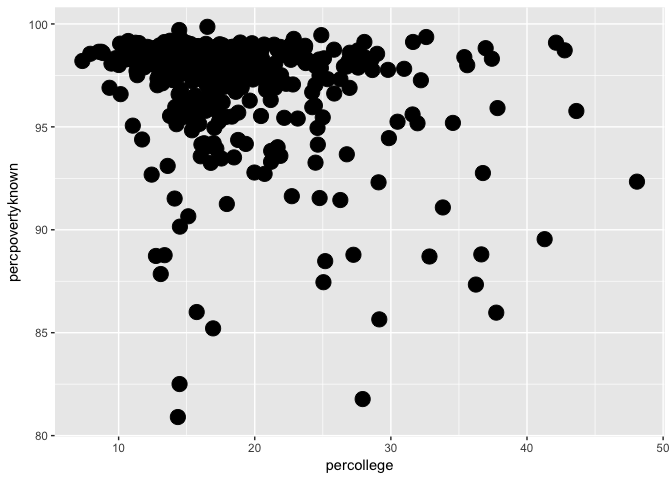
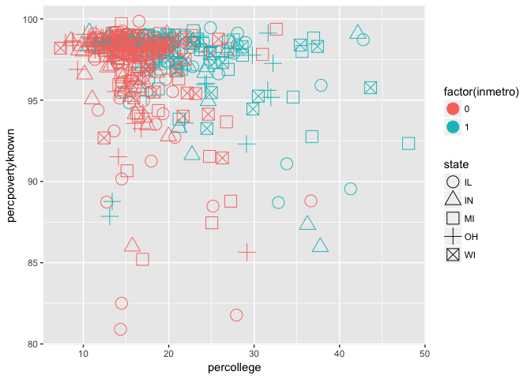
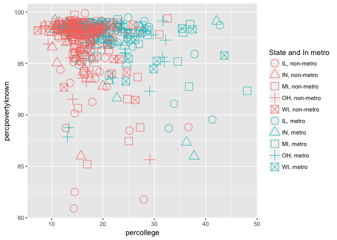

Multiviriate Grouping in ggplot2 (Scatter Plot)
================

The document aims to provide thoughts on how to group samples based on more than one variable and create non-redundant legends when doing scatter plots using the ggplot2 package. First, install the plotting package ggplot2 (if it has not been done yet) and load this package. To get most recent version of ggplot2, using most recent version of R is recommended.

``` r
#install.packages("ggplot2")
library(ggplot2)
```

Then, take a look at the dataset that will be used in this tutorial, midwest. This is a built-in dataset in ggplot2, so no other installations are required.

``` r
head(midwest)
```

    ## # A tibble: 6 x 28
    ##     PID county    state   area poptotal popdensity popwhite popblack
    ##   <int> <chr>     <chr>  <dbl>    <int>      <dbl>    <int>    <int>
    ## 1   561 ADAMS     IL    0.0520    66090       1271    63917     1702
    ## 2   562 ALEXANDER IL    0.0140    10626        759     7054     3496
    ## 3   563 BOND      IL    0.0220    14991        681    14477      429
    ## 4   564 BOONE     IL    0.0170    30806       1812    29344      127
    ## 5   565 BROWN     IL    0.0180     5836        324     5264      547
    ## 6   566 BUREAU    IL    0.0500    35688        714    35157       50
    ## # ... with 20 more variables: popamerindian <int>, popasian <int>,
    ## #   popother <int>, percwhite <dbl>, percblack <dbl>, percamerindan <dbl>,
    ## #   percasian <dbl>, percother <dbl>, popadults <int>, perchsd <dbl>,
    ## #   percollege <dbl>, percprof <dbl>, poppovertyknown <int>,
    ## #   percpovertyknown <dbl>, percbelowpoverty <dbl>,
    ## #   percchildbelowpovert <dbl>, percadultpoverty <dbl>,
    ## #   percelderlypoverty <dbl>, inmetro <int>, category <chr>

Basically, it is a data frame with 437 rows and 28 variables that contains demographic information of midwest counties. For explanations of each column in this dataset, please refer to this webpage: <http://ggplot2.tidyverse.org/reference/midwest.html>
Now the question is to ask the relationship between percollege (Percent college educated) and percpovertyknown (Percent poverty known). We can easily draw a scatter plot using geom\_point( ) command in ggplot2 (point size is set to 5).

``` r
ggplot(midwest, aes(percollege, percpovertyknown)) + geom_point(size = 5)
```



Next, we want to see whether states and being located in metro area these two variables are related to education and poverty percentage. In this case, we can draw the same scatter plot and group all points by both state and inmetro (In a metro area) using different colours and shape respectively. Change the class of inmetro to factor, in case ggplot2 may view it as a continuous variable. Set solid to F to get hollow shapes.

``` r
ggplot(midwest, aes(percollege, percpovertyknown, colour = factor(inmetro), shape = state)) + geom_point(size = 5) +
  scale_shape_discrete(solid=F)
```



Now the goal is to merge colour legend and shape legend into one. We can achieve it by creating a new variable that account for both state and inmetro. Then use the same name for both colour and shape legend.

``` r
midwest_modified<-midwest
midwest_modified$state<-as.factor(midwest_modified$state)
midwest_modified$inmetro<-as.factor(midwest_modified$inmetro)
state_inmetro <- interaction(midwest_modified$state, midwest_modified$inmetro, sep = "_") # create a factor that account for both state and inmetro
#create character vectors for colour, shape and label
override.colour <- c("#F8766D", "#F8766D", "#F8766D", "#F8766D", "#F8766D", "#00BFC4", "#00BFC4", "#00BFC4", "#00BFC4", "#00BFC4")
names(override.colour) <- c("IL_0", "IN_0", "MI_0", "OH_0", "WI_0", "IL_1", "IN_1", "MI_1", "OH_1", "WI_1")
override.shape <- c(1, 2, 0, 3, 7, 1, 2, 0, 3, 7)
names(override.shape) <- c("IL_0", "IN_0", "MI_0", "OH_0", "WI_0", "IL_1", "IN_1", "MI_1", "OH_1", "WI_1")
override.label <- c("IL, non-metro", "IN, non-metro", "MI, non-metro", "OH, non-metro", "WI, non-metro", "IL, metro", "IN, metro", "MI, metro", "OH, metro", "WI, metro")
names(override.label) <- c("IL_0", "IN_0", "MI_0", "OH_0", "WI_0", "IL_1", "IN_1", "MI_1", "OH_1", "WI_1")
#plug arguments into ggplot function
ggplot(midwest_modified, aes(percollege, percpovertyknown, colour = state_inmetro, shape = state_inmetro)) + geom_point(size = 5) +
  scale_colour_manual(name = "State and In metro", values = override.colour, labels = override.label)+
  scale_shape_manual(name = "State and In metro", values = override.shape, labels = override.label)
```


